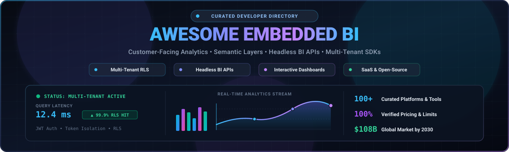
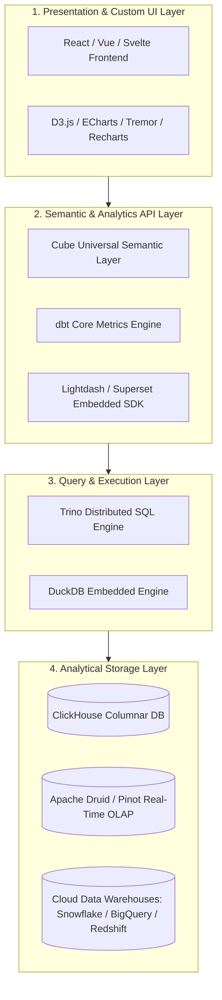
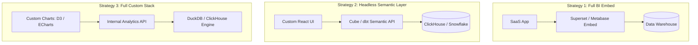

<div align="center">



# 📊 Awesome Embedded BI

<a href="https://github.com/ishandutta2007/Awesome-Awesome-Awesome"></a><a href="https://discord.gg/jc4xtF58Ve"></a> <a href="https://github.com/ishandutta2007/Awesome-Embedded-BI/stargazers"></a> <a href="https://github.com/ishandutta2007/Awesome-Embedded-BI/network/members"></a> <a href="https://github.com/ishandutta2007/Awesome-Embedded-BI/blob/main/LICENSE"></a><a href="https://github.com/ishandutta2007"></a>

**A comprehensive, SEO-optimized curated directory of Embedded Business Intelligence (Embedded BI), customer-facing analytics, white-label reporting platforms, headless semantic layers, BI SDKs, and open-source alternatives for modern software engineering.**

---

🎯 **Keywords:** `embedded-bi` • `embedded-analytics` • `customer-facing-analytics` • `semantic-layer` • `headless-bi` • `data-visualization` • `dashboards` • `business-intelligence` • `multi-tenant-analytics` • `bi-sdk`

</div>

---

## 📖 Introduction & Overview

Embedded Business Intelligence (Embedded BI) integrates **interactive dashboards, data exploration, self-service reporting, semantic modeling, drill-downs, dynamic filtering, multi-tenancy, row-level security (RLS), and white-labeling** directly into SaaS applications, customer portals, and internal enterprise software.

Whether you need a full turnkey hosted analytics suite or want to assemble a flexible open-source headless analytics stack with semantic APIs, this curated collection provides verified pricing, valuation metrics, GitHub star counts, and technical architectures.

---

## 📑 Table of Contents

* [☁️ SaaS & Hosted Embedded BI Platforms](#️-saas--hosted-embedded-bi-platforms)
* [🌍 Open-Source Embedded BI & Analytics Frameworks](#-open-source-embedded-bi--analytics-frameworks)
* [🧩 Open-Source Embedded BI Building Blocks](#-open-source-embedded-bi-building-blocks)
  * [📊 Complete BI Platforms](#-complete-bi-platforms)
  * [🧠 Semantic Layer & Headless BI](#-semantic-layer--headless-bi)
  * [📈 Visualization & Charting Libraries](#-visualization--charting-libraries)
  * [🗄️ High-Performance Analytics Databases](#️-high-performance-analytics-databases)
  * [🛠️ Low-Code & App Builders](#️-low-code--app-builders)
* [🏗️ Embedded BI Architecture & Data Flow](#️-embedded-bi-architecture--data-flow)
* [🔐 Multi-Tenant Security & Isolation Models](#-multi-tenant-security--isolation-models)
* [🔌 Integration Paradigms: Iframe vs SDK vs Headless API](#-integration-paradigms-iframe-vs-sdk-vs-headless-api)
* [🔍 Commercial vs. Open-Source Comparison](#-commercial-vs-open-source-comparison)
* [⭐ Recommended Open-Source Stacks](#-recommended-open-source-stacks)
* [💡 Three Strategic Implementation Blueprints](#-three-strategic-implementation-blueprints)
* [🚧 Where Open Source Still Has Gaps](#-where-open-source-still-has-gaps)
* [🤝 How to Contribute](#-how-to-contribute)
* [⭐ Star History](#-star-history)
* [⚠️ Disclaimer](#️-disclaimer)

---

## ☁️ SaaS & Hosted Embedded BI Platforms

> 📈 **Market Overview:** The global Embedded Business Intelligence (BI) and analytics market is valued at **~$45.8 Billion in 2024 and is projected to reach ~$108.7 Billion by 2030 (CAGR of ~15.5%)**. The industry is **moderately fragmented**—featuring top-tier cloud hyperscalers (Microsoft, Google, Salesforce) commanding enterprise-wide ecosystems, alongside an agile, highly competitive landscape of developer-first and API-first pure-play SaaS platforms serving product engineering teams.

The table below details major commercial and hosted embedded BI platforms, sorted in descending order by **Company Size (Valuation / Market Capitalization / Parent Revenue)**:

| Platform | Description | Primary Focus | Company Size (Valuation / Revenue) | Pricing | Free Tier Limit |
| :--- | :--- | :--- | :--- | :--- | :--- |
| 🌐 [Power BI Embedded](https://azure.microsoft.com/products/power-bi-embedded) | Microsoft Azure service for embedding Power BI reports and interactive dashboards into custom applications. | 🏢 Enterprise Embedded BI | **~$3.1T Market Cap** (Microsoft / Revenue ~$245B+) | Starts at **$1.01/hour** (~$735/mo for 24/7 continuous A1 capacity SKU, pauseable when idle) | Free embed trial tokens for dev/testing (includes watermarked trial banner; no production limit) |
| 🔍 [Looker Embedded](https://cloud.google.com/looker) | Google Cloud's enterprise analytics offering for embedding governed dashboards, LookML models, and explores. | 🏢 Enterprise Embedded BI | **~$2.1T Market Cap** (Alphabet / Google Cloud ~$36B+ ARR) | Starts at **~$5,000/mo** (~$60,000–$66,000/yr base platform + per-viewer licenses) | 30-day sales-assisted evaluation/POC instance (or free tier via Looker Studio for basic reporting) |
| 📊 [Tableau Embedded](https://www.tableau.com/products/embedded-analytics) | Salesforce Tableau suite for embedding interactive dashboards and visual analytics into portals and SaaS tools. | 🏢 Enterprise Embedded BI | **~$300B Market Cap** (Salesforce / Tableau unit ~$2.5B+ Rev) | Starts at **~$115/user/mo** (Creator) / ~$35/user/mo (Viewer) / ~$60,000/yr (Embedded ISV contract) | Free Developer Sandbox via Tableau Developer Program (includes Embedding Playground); 30-day trial |
| ⚡ [Qlik Embedded](https://www.qlik.com/us/products/qlik-embedded-analytics) | Developer platform for embedding Qlik associative engine dashboards, charts, and data workflows. | 📊 Embedded Analytics | **~$10.0B Valuation** (Thoma Bravo / Revenue ~$750M+) | Starts at **~$300/mo** (Qlik Cloud Analytics Standard, billed annually, 10 users, 10 GB data) | 30-day free trial with full access to Qlik Cloud Analytics, AI insights, and embedding APIs |
| 💡 [ThoughtSpot Embedded](https://www.thoughtspot.com/product/embedded) | AI-powered analytics platform combining search-driven exploration, interactive Liveboards, and developer SDKs. | 🤖 AI Embedded Analytics | **~$4.5B Valuation** (Private Unicorn / ARR ~$150M+) | Free (Developer) / **$25/user/mo** (Essentials) / $0.10/credit (Pro) / $12,999/yr (Startup Bundle) | Free Developer tier for 1 year (up to 10 users & 25M data rows); 14-day free trial for Enterprise |
| 📑 [Logi Analytics](https://insightsoftware.com/logi/) | Developer-first embedded analytics and reporting platform (Logi Symphony) for complex software applications. | 📊 Embedded BI | **~$4.0B Valuation** (insightsoftware / ARR ~$500M+) | Starts at **~$100–$500/mo** (Standard modules) / ~$16,000/yr (Base embedded deployment) | 15-day free trial license with evaluation software access |
| 📈 [Yellowfin](https://www.yellowfinbi.com/) | Enterprise BI and embedded analytics platform providing dashboards, data storytelling, and automated signals. | 📊 Embedded BI | **~$3.0B Valuation** (Idera, Inc. / Group Rev ~$400M+) | Starts at **~$19/user/mo** (or ~$3,000–$10,000/yr base server tier) | 30-day free trial with full visualization, dashboarding, and analytics features |
| 🚀 [Sisense / Fusion](https://www.sisense.com/) | Complete embedded analytics platform providing Compose SDK, APIs, data modeling, and white-labeling. | ⭐ Embedded Analytics | **~$1.0B Valuation** (Private Unicorn / ARR ~$150M+) | Starts at **~$399/mo** (Launch tier) / ~$10,000–$35,000/yr (Self-Serve base) | 7-day free trial ("Test Drive") with full access to Compose SDK and sandboxed analytics |
| 🗃️ [Metabase Cloud](https://www.metabase.com/) | Hosted version of Metabase providing managed cloud infrastructure, embedded dashboards, and visual queries. | ☁️ Hosted BI | **~$800M Valuation** (Series B / ARR ~$25M+) | Starts at **$90/mo** (billed annually at $1,080/yr) or $100/mo (Starter, 5 users; Pro from $518/mo) | 14-day free trial of Metabase Cloud (no credit card required); Metabase Open Source is free forever |
| 📱 [Domo Everywhere](https://www.domo.com/platform/embedded-analytics) | Cloud BI platform for sharing dashboards, automated data pipelines, and embedded customer-facing apps. | 📊 Embedded BI | **~$380M Market Cap** (NASDAQ: DOMO / Rev ~$320M) | Starts at **~$300/mo** (Standard tier) / ~$50,000/yr (Enterprise credit packages) | 30-day free trial with unlimited access to ETL, dashboards, connectors, and embedded features |
| 💼 [Phocas Embedded](https://www.phocassoftware.com/) | Industry-focused embedded analytics and reporting platform for ERP, financial, and operational SaaS products. | 📊 Operational BI | **~$300M Valuation** (Private / ARR ~$50M+) | Starts at **~$150/user/mo** (or ~$1,800/yr per named user + base platform fee) | 30-day sales-assisted evaluation environment (or 30–60 min interactive live POC demo) |
| 🧩 [GoodData](https://www.gooddata.com/) | Developer-oriented analytics platform offering headless BI, metrics-as-code, and embeddable UI SDKs. | 🧠 Headless BI & SDKs | **~$250M Valuation** (Raised $100M+ / ARR ~$40M+) | Starts at **~$1,500/mo** (Professional tier per workspace) | 30-day free trial with full platform access (AI assistant, embedded dashboards, analytics APIs) |
| 🔮 [Preset](https://preset.io/) | Fully managed Apache Superset cloud platform providing governed dashboards and embedded viewer capabilities. | ⚡ Managed Superset BI | **~$200M Valuation** (Series B / ARR ~$15M+) | Free (Starter) / Starts at **$25/user/mo** (Professional; Embedded add-on from $500/mo for 50 viewers) | Free forever Starter plan (up to 5 users, 1 workspace; hibernates after 30 days of inactivity) |
| 🪟 [Bold BI](https://www.boldbi.com/) | Embedded BI platform providing rich JavaScript SDKs, API connectors, multi-tenant security, and white-labeling. | ⭐ Embedded BI | **~$100M+ Parent Rev** (Syncfusion / Bootstrapped Enterprise) | Free (Community) / Starts at **~$495/mo** (~$5,940/yr flat license) | Free Community License (unlimited dashboards for 1 app for early-stage teams); 30-day Cloud trial |
| 🛠️ [Explo](https://www.explo.co/) | Modern developer platform built to embed customer-facing analytics dashboards and scheduled reports into SaaS. | 🚀 SaaS Embedded Analytics | **~$75M Valuation** (YC W20 / Raised $15M+ / ARR ~$8M+) | Free (Internal BI) / Starts at **$695–$995/mo** (Growth) / $1,995/mo (Pro embedded) | Free forever for internal BI (unlimited users & dashboards); 7-day free trial for embedded analytics |
| 🎨 [Luzmo](https://www.luzmo.com/) | Developer-friendly embedded analytics platform featuring visual dashboard editors, SDKs, and fast API queries. | 📊 Embedded Analytics | **~$45M Valuation** (formerly Cumul.io / Raised $14M+) | Starts at **$995/mo** (~€1,995/mo for Pro, billed annually based on Monthly Active Viewers) | 10-day free trial with full access to dashboard editor, API integration, and dataset uploads |
| 💻 [Embeddable](https://embeddable.com/) | Developer-first platform for building completely custom, code-owned customer analytics using React/Vue components. | 💻 Developer Embedded BI | **~$30M Valuation** (GV-backed / Raised $6M+) | Starts at **~$499–$995/mo** (Flat-rate session-based subscription) | 14-day developer trial / sandbox access to SDK, headless components, and live playground |
| 📐 [Holistics](https://www.holistics.io/) | Self-service BI platform with reusable data modeling, dbt integration, canvas dashboards, and embedded widgets. | 📊 Embedded BI | **~$25M Valuation** (Bootstrapped / ARR ~$5M–$10M) | Starts at **$800/mo** (billed annually at $9,600/yr) or $960/mo (Entry; Embedded add-on from $800/mo) | 14-day free trial with full feature access and no credit card required (extendable to 21 days on request) |
| 📱 [Reveal BI](https://www.revealbi.io/) | Native SDK for embedding interactive dashboards and self-service analytics into web, desktop, and mobile apps. | 📱 Embedded SDK | **~$25M Valuation** (Infragistics division) | Starts at **~$9,995/yr** (Flat annual fee per application with unlimited users) | 30-day free trial of SDK (license key required; full dashboard and embedding features) |

---

## 🌍 Open-Source Embedded BI & Analytics Frameworks

> ⭐ **Open-source software is the core foundation of self-hosted and white-labeled analytics.**

The table below lists the top open-source business intelligence platforms, headless semantic engines, charting engines, analytical databases, and low-code builders. Sorted in descending order by **GitHub Star Count**:

| Project & Repo Link | Star Count Badge | Description | Category & Best Use |
| :--- | :--- | :--- | :--- |
| 📈 [D3.js](https://github.com/d3/d3) | [](https://github.com/d3/d3/stargazers) | Low-level JavaScript visualization library and toolkit for custom data graphics and dynamic interactive charts. | 🎨 Custom Visualization Engine |
| 📊 [Grafana](https://github.com/grafana/grafana) | [](https://github.com/grafana/grafana/stargazers) | Open-source visualization and dashboard platform with multi-tenant panels, data connectors, and iframe/SDK embedding. | ⏱️ Operational & Time-Series Dashboards |
| 🚀 [Apache Superset](https://github.com/apache/superset) | [](https://github.com/apache/superset/stargazers) | Enterprise-grade BI platform with interactive dashboards, SQL Lab, geospatial charts, row-level security, and embedded SDK. | ⭐ Full-Featured Embedded BI |
| 📊 [Chart.js](https://github.com/chartjs/Chart.js) | [](https://github.com/chartjs/Chart.js/stargazers) | Simple, clean, and flexible HTML5 canvas charting library for lightweight embedded visualizations. | 📈 Lightweight Charting |
| 📈 [Apache ECharts](https://github.com/apache/echarts) | [](https://github.com/apache/echarts/stargazers) | Powerful declarative charting and visualization library for highly interactive, scalable web application dashboards. | 📊 Rich Interactive Charting |
| 🗃️ [NocoDB](https://github.com/nocodb/nocodb) | [](https://github.com/nocodb/nocodb/stargazers) | Open-source Airtable alternative that turns any relational database into a smart spreadsheet with chart views and shareable dashboards. | 📑 Low-Code Database & Views |
| ⚡ [ClickHouse](https://github.com/ClickHouse/ClickHouse) | [](https://github.com/ClickHouse/ClickHouse/stargazers) | Fast open-source column-oriented analytical database management system for real-time customer-facing BI queries. | 🗄️ Real-Time OLAP Backend |
| 🔍 [Metabase](https://github.com/metabase/metabase) | [](https://github.com/metabase/metabase/stargazers) | User-friendly BI and embedded analytics platform with visual query builders, SQL editor, and JWT-signed iframe embedding. | ⭐ Customer Analytics & Self-Service |
| 🦆 [DuckDB](https://github.com/duckdb/duckdb) | [](https://github.com/duckdb/duckdb/stargazers) | Fast in-process analytical SQL database engine ideal for client-side (WASM) and serverless embedded analytics. | 🗄️ In-Process Analytical Engine |
| 🛠️ [ToolJet](https://github.com/tooljet/tooljet) | [](https://github.com/tooljet/tooljet/stargazers) | Extensible open-source low-code platform for building business intelligence applications, dashboards, and internal developer tools. | 🛠️ Low-Code Dashboard Builder |
| 🛠️ [Appsmith](https://github.com/appsmithorg/appsmith) | [](https://github.com/appsmithorg/appsmith/stargazers) | Open-source low-code developer platform for building custom internal tools, admin panels, and embedded analytics dashboards. | 🛠️ Internal Apps & Dashboards |
| 🦔 [PostHog](https://github.com/posthog/posthog) | [](https://github.com/posthog/posthog/stargazers) | Open-source product analytics, session recording, feature flags, and customer data platform with embeddable insights. | 📱 Product & User Analytics |
| 📊 [Redash](https://github.com/getredash/redash) | [](https://github.com/getredash/redash/stargazers) | SQL-first query editor, data visualization, and dashboarding platform with embeddable widgets and public links. | 💻 SQL-First BI & Queries |
| 📉 [Recharts](https://github.com/recharts/recharts) | [](https://github.com/recharts/recharts/stargazers) | Redesigned charting library built with React and D3 for seamlessly building customized embedded React analytics dashboards. | ⚛️ React Analytics Components |
| 🧊 [Cube](https://github.com/cube-js/cube) | [](https://github.com/cube-js/cube/stargazers) | Open-source semantic layer and universal analytics API platform for building custom, headless embedded BI applications. | ⭐ Headless BI & Semantic APIs |
| 📈 [Plotly.js](https://github.com/plotly/plotly.js) | [](https://github.com/plotly/plotly.js/stargazers) | High-level declarative charting library built on top of D3.js and WebGL for interactive scientific and business visualizations. | 🔬 Scientific & Business Visuals |
| ⚡ [Apache Druid](https://github.com/apache/druid) | [](https://github.com/apache/druid/stargazers) | High-performance, real-time analytics database designed for sub-second OLAP queries in customer-facing analytics. | 🗄️ Real-Time OLAP Backend |
| 🌐 [Trino](https://github.com/trinodb/trino) | [](https://github.com/trinodb/trino/stargazers) | Distributed SQL query engine for running fast analytical queries against disparate data sources for embedded BI backends. | 🔍 Distributed SQL Query Engine |
| 📊 [Vega](https://github.com/vega/vega) | [](https://github.com/vega/vega/stargazers) | Declarative visualization grammar for creating, saving, and sharing interactive visualization designs across web apps. | 📐 Declarative Visualization |
| 📝 [Evidence](https://github.com/evidence-dev/evidence) | [](https://github.com/evidence-dev/evidence/stargazers) | Code-first open-source BI framework for building interactive analytics dashboards using Markdown and SQL. | ⭐ Code-First / Markdown BI |
| 📓 [Apache Zeppelin](https://github.com/apache/zeppelin) | [](https://github.com/apache/zeppelin/stargazers) | Web-based notebook for data ingestion, exploration, visualization, and collaborative analytics. | 📓 Interactive Analytics Notebook |
| 🍷 [Apache Pinot](https://github.com/apache/pinot) | [](https://github.com/apache/pinot/stargazers) | Real-time distributed OLAP datastore built for ultra-low latency customer-facing analytics at massive scale. | 🗄️ Ultra-Low Latency OLAP |
| 💡 [Lightdash](https://github.com/lightdash/lightdash) | [](https://github.com/lightdash/lightdash/stargazers) | Open-source modern BI platform built natively on dbt metrics, offering self-service exploration and embeddable dashboards. | ⭐ dbt-Native Embedded BI |
| 📊 [Vega-Lite](https://github.com/vega/vega-lite) | [](https://github.com/vega/vega-lite/stargazers) | High-level grammar of interactive graphics providing concise JSON syntax for creating embedded visualizations. | 📐 Declarative Graphics Grammar |
| 🎨 [Tremor](https://github.com/tremorlabs/tremor) | [](https://github.com/tremorlabs/tremor/stargazers) | React component library designed specifically for building modern, aesthetic data dashboards and analytics applications. | ⚛️ Dashboard UI Component Kit |
| ⚡ [Rill](https://github.com/rilldata/rill) | [](https://github.com/rilldata/rill/stargazers) | Fast, code-first developer BI platform that pairs an embedded DuckDB engine with real-time interactive dashboards. | ⚡ Fast Developer Analytics |
| 📄 [JasperReports](https://github.com/TIBCOSoftware/jasperreports) | [](https://github.com/TIBCOSoftware/jasperreports/stargazers) | Mature Java reporting and pixel-perfect document generation engine designed for seamless application embedding. | 📄 Embedded Java Reporting |
| 🌀 [Helical Insight](https://github.com/helicalinsight/helicalinsight) | [](https://github.com/helicalinsight/helicalinsight/stargazers) | Framework-driven open-source BI platform offering customizable embedded dashboards, ad-hoc reports, and workflow automation. | 🏢 Enterprise Embedded BI |
| 📑 [Eclipse BIRT](https://github.com/eclipse-birt/birt) | [](https://github.com/eclipse-birt/birt/stargazers) | Open-source reporting system and visual designer for embedding data visualizations and reports in enterprise Java apps. | 📄 Java Report Designer |
| 📦 [Pentaho Platform](https://github.com/pentaho/pentaho-platform) | [](https://github.com/pentaho/pentaho-platform/stargazers) | Comprehensive open-source enterprise analytics and data integration platform with reporting engines. | 🏢 Enterprise Data Suite |
| 🏛️ [Knowage](https://github.com/KnowageLabs/Knowage-Server) | [](https://github.com/KnowageLabs/Knowage-Server/stargazers) | Open-source enterprise BI suite covering standard reporting, dashboards, multidimensional OLAP, and data mining. | 🏢 Enterprise BI Suite |

---

## 🧩 Open-Source Embedded BI Building Blocks

An Embedded BI architecture is typically modular and composed of four core functional tiers:



### 📊 Complete BI Platforms
* **[Apache Superset](https://github.com/apache/superset)** — Enterprise SQL exploration, multi-tenant row-level security, rich visualizations, and official embedded SDK.
* **[Metabase](https://github.com/metabase/metabase)** — Visual query builders, interactive dashboard cards, and JWT-authenticated iframe embedding.
* **[Lightdash](https://github.com/lightdash/lightdash)** — dbt-native BI platform with governed metric definitions and modern developer workflows.
* **[Grafana](https://github.com/grafana/grafana)** — Operational dashboards, plugin architectures, alerts, and time-series metrics.
* **[Evidence](https://github.com/evidence-dev/evidence)** — Markdown + SQL code-first reporting framework.
* **[Rill](https://github.com/rilldata/rill)** — Real-time exploratory dashboards powered by DuckDB.
* **[Redash](https://github.com/getredash/redash)** — SQL query builder and shareable dashboard widgets.

### 🧠 Semantic Layer & Headless BI
* **[Cube](https://github.com/cube-js/cube)** — Universal semantic layer providing caching, pre-aggregations, access control, and REST/GraphQL/SQL APIs.
* **[dbt Core](https://github.com/dbt-labs/dbt-core)** — Open-source data transformation and governed metric modeling.

### 📈 Visualization & Charting Libraries
* **[D3.js](https://github.com/d3/d3)** — Low-level SVG/Canvas manipulation for bespoke visualizations.
* **[Apache ECharts](https://github.com/apache/echarts)** — High-performance interactive charting with GL rendering.
* **[Chart.js](https://github.com/chartjs/Chart.js)** — Lightweight, clean HTML5 canvas charts.
* **[Recharts](https://github.com/recharts/recharts)** — Native React charting components built on D3.
* **[Tremor](https://github.com/tremorlabs/tremor)** — Tailwind CSS + React components designed specifically for analytics dashboards.
* **[Plotly.js](https://github.com/plotly/plotly.js)** — Declarative scientific and statistical graphing.
* **[Vega](https://github.com/vega/vega)** & **[Vega-Lite](https://github.com/vega/vega-lite)** — Grammar of graphics in concise JSON specs.

### 🗄️ High-Performance Analytics Databases
* **[ClickHouse](https://github.com/ClickHouse/ClickHouse)** — Blazing-fast columnar DBMS for real-time customer analytics.
* **[DuckDB](https://github.com/duckdb/duckdb)** — In-process SQL OLAP database ideal for client-side and serverless workloads.
* **[Apache Druid](https://github.com/apache/druid)** & **[Apache Pinot](https://github.com/apache/pinot)** — Sub-second distributed OLAP databases for massive event ingestion.
* **[Trino](https://github.com/trinodb/trino)** — Distributed SQL query engine across lakes, warehouses, and relational databases.

### 🛠️ Low-Code & App Builders
* **[Appsmith](https://github.com/appsmithorg/appsmith)** — Open-source framework for building internal dashboards and customer tools.
* **[ToolJet](https://github.com/tooljet/tooljet)** — Low-code platform with 50+ data source connectors for internal analytics.
* **[NocoDB](https://github.com/nocodb/nocodb)** — Smart spreadsheet database interface with shareable chart views.

---

## 🏗️ Embedded BI Architecture & Data Flow

A scalable, multi-tenant customer-facing embedded analytics architecture follows a clean separation of concerns:

```text
                     ┌─────────────────────────────────────────────────┐
                     │          Customer Browser / Mobile App          │
                     │  (React / Vue App with Embedded Dashboard/SDK)  │
                     └────────────────────────┬────────────────────────┘
                                              │
                         1. User Authentication (JWT / Session)
                                              ▼
                     ┌─────────────────────────────────────────────────┐
                     │              Your SaaS Backend API              │
                     │  - Validates tenant ID                          │
                     │  - Signs scoped Embed Token / JWT with RLS rules │
                     └────────────────────────┬────────────────────────┘
                                              │
                         2. Request Embedded Content with Token
                                              ▼
                     ┌─────────────────────────────────────────────────┐
                     │           Embedded BI / Semantic Engine         │
                     │  (Cube / Superset / Lightdash / Metabase)       │
                     │  - Enforces Tenant Row-Level Security (RLS)    │
                     │  - Validates Cache & Pre-aggregations           │
                     └────────────────────────┬────────────────────────┘
                                              │
                         3. Optimized SQL Query Execution
                                              ▼
                     ┌─────────────────────────────────────────────────┐
                     │        High-Speed Analytical Warehouse          │
                     │  (ClickHouse / DuckDB / Snowflake / BigQuery)   │
                     └─────────────────────────────────────────────────┘
```

---

## 🔐 Multi-Tenant Security & Isolation Models

Multi-tenancy is the single most critical architectural requirement in Embedded BI. The three predominant isolation strategies are:

1. **Row-Level Security (RLS) in a Shared Database / Schema:**
   * *Mechanism:* Every analytical table contains a `tenant_id` or `organization_id` column. The semantic layer or BI engine automatically appends `WHERE tenant_id = :current_tenant` to every generated query.
   * *Pros:* Cost-efficient, simple schema management, unified infrastructure.
   * *Cons:* Requires strict auditing to prevent data leak bugs.

2. **Schema-per-Tenant Isolation:**
   * *Mechanism:* Each tenant receives a dedicated schema within the same analytical database instance.
   * *Pros:* Stronger logical isolation; easy per-tenant data deletion/backup.
   * *Cons:* Migration overhead across hundreds or thousands of schemas.

3. **Database / Warehouse-per-Tenant:**
   * *Mechanism:* Each customer operates in a completely isolated database instance or cloud warehouse account.
   * *Pros:* Strict physical compliance (HIPAA, SOC2, FedRAMP).
   * *Cons:* Higher base infrastructure costs and complex connection pooling.

---

## 🔌 Integration Paradigms: Iframe vs SDK vs Headless API

| Integration Paradigm | Developer Effort | UX Customization | Security Model | Recommended Tools |
| :--- | :--- | :--- | :--- | :--- |
| **🖼️ Signed Iframe Embedding** | 🟢 Low (Hours) | 🟡 Medium (Themes, CSS presets) | JWT-signed tokens with embedded parameters | Metabase, Preset, Superset, Power BI |
| **📦 JavaScript / Web SDK** | 🟡 Medium (Days) | 🟢 High (Interactive filters, custom events) | Scoped guest tokens, SDK event listeners | Superset Embedded SDK, Sisense Compose SDK, Bold BI |
| **🧠 Headless Semantic API** | 🔴 High (Weeks) | 🟢 Complete 100% Native UX | Backend token authentication & API RLS | Cube, Lightdash, Embeddable, ClickHouse + React |

---

## 🔍 Commercial vs. Open-Source Comparison

| Evaluation Metric | Commercial Embedded BI (SaaS) | Open-Source Self-Hosted Stack |
| :--- | :---: | :---: |
| **Time to Initial MVP** | 🟢 Fast (Turnkey) | 🟡 Moderate (Requires setup & infra) |
| **Long-Term Scaling Cost** | 🔴 High (Steep seat / viewer / session fees) | 🟢 Low (Only pay for compute & storage) |
| **UI Customization & Native Look** | 🟡 Moderate (White-labeling constraints) | 🟢 Total (Full code & pixel-level control) |
| **Vendor Lock-in Risk** | 🔴 High (Proprietary format & engines) | 🟢 Low (Open standards, SQL, dbt models) |
| **Multi-Tenant Administration** | 🟢 Out-of-the-box admin consoles | 🟡 Requires developer configuration |
| **Infrastructure Management** | 🟢 Fully Managed / Zero maintenance | 🔴 Requires DevOps, monitoring, and updates |
| **Data Privacy & Air-Gapped Deployments**| 🟡 Cloud-dependent (Vendor compliance) | 🟢 100% Self-contained within VPC |

---

## ⭐ Recommended Open-Source Stacks

Depending on your engineering priorities, these curated stacks provide the highest reliability and developer velocity:

* **Stack A — Fast Turnkey Customer Dashboards:**  
  `SaaS App (React/Vue)` ➔ `Apache Superset (Embedded SDK + JWT)` ➔ `PostgreSQL / ClickHouse`
* **Stack B — 100% Native Product UX (Headless):**  
  `SaaS UI (Tremor / Recharts / D3)` ➔ `Cube (Semantic REST/GraphQL API)` ➔ `ClickHouse / Snowflake`
* **Stack C — Modern dbt-Governed Metrics:**  
  `SaaS App` ➔ `Lightdash (Embed)` ➔ `dbt Core Semantic Models` ➔ `Cloud Warehouse`
* **Stack D — Lightning In-Process Client/Edge Analytics:**  
  `Web Application (React / Svelte)` ➔ `Evidence / Rill` ➔ `DuckDB (WASM / Serverless)`

---

## 💡 Three Strategic Implementation Blueprints



---

## 🚧 Where Open Source Still Has Gaps

While open-source embedded BI has advanced dramatically, commercial vendors maintain competitive advantages in:

* 🏢 **Turnkey Tenant Admin Portals** (automated client self-provisioning, white-label subdomain routing).
* 🎨 **Client-Facing Self-Service Visual Query Builders** for non-technical end users.
* 🤖 **AI-Assisted Natural Language Exploration** natively integrated with complex enterprise RLS.
* 📜 **Automated Regulatory Compliance & SLAs** (HIPAA, SOC 2 Type II, FedRAMP out-of-the-box).

---

## 🤝 How to Contribute

Contributions are warmly welcomed! Help expand this directory by following these steps:

1. Fork this repository: `https://github.com/ishandutta2007/Awesome-Embedded-BI`
2. Add your project or update existing data (ensure transparent pricing, free tier limits, and accurate GitHub star links).
3. Ensure the project matches the scope of **Embedded BI, Customer-Facing Analytics, Semantic Layers, or Data Visualization SDKs**.
4. Submit a Pull Request with a clear description of changes.

For curated lists across other engineering domains, explore [Awesome Awesome Awesome](https://github.com/ishandutta2007/Awesome-Awesome-Awesome).

---

## ⭐ Star History

[](https://star-history.dera.page/#ishandutta2007/Awesome-Embedded-BI&type=date&legend=top-left)

---

## ⚠️ Disclaimer

This repository is a **curated software directory**, not an endorsement. Licensing, pricing terms, and embedding provisions can change over time. Always verify the current vendor terms and open-source licenses before deploying in commercial production software.

**Last updated: September 2026**
